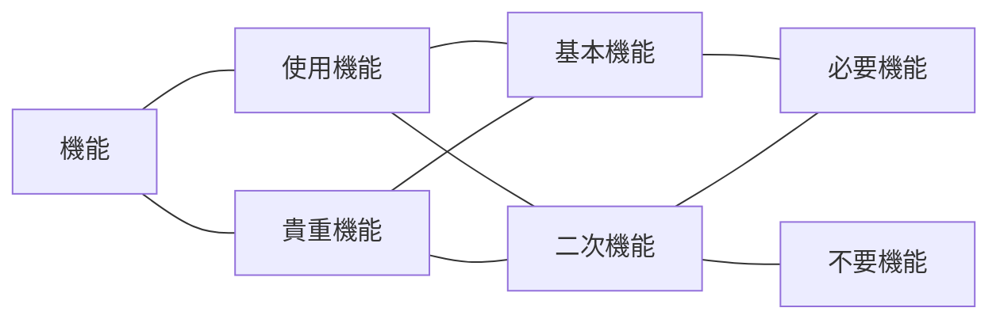

# VE

- 製品やサービスの価値を、それが果たすべき機能とそのためにかけるコストとの関係で把握し、システム化された手順によって価値の向上を図る手法

## 価値の定義

$$
V（価値） = \frac{F（機能）}{C（コスト）}
$$

### 価値向上のアプローチ

* 機能を維持・向上させつつ、コストを下げる
* コストを維持しつつ、機能を向上させる
* コストが増加しても、それ以上に機能を向上させる
* コストを下げつつ機能も多少下げるが、下げ幅以上にコストを下げる

#### 注意点

- コストを一定に保ったまま機能を**低下**させることは、価値（V=F/C）を**低下**させる組み合わせであり、価値向上のアプローチには該当しない

### VA（バリューアナリシス）

- VEと同様の考え方を、既存の製品やサービスの改善に適用する場合はVA（Value Analysis）と呼ばれる
- VEは主に新製品・新サービスの企画・開発段階に、VAは既存製品の改善段階に適用される

|            用語            | 意味                                                                                                                                             | 具体例 |
| :------------------------: | ------------------------------------------------------------------------------------------------------------------------------------------------ | ------ |
|          使用機能          | 機能について、その**性質**からみた機能の種類のひとつであり、**製品やサービスを使用するために備えていなければならない機能**のこと     | 電気ケトルで水を加熱して湯を沸かす、湯を注ぐ |
|          貴重機能          | 機能について、その**性質**から見た機能の種類のひとつであり、**製品の意匠や外観など、顧客（使用者）に魅力を感じさせる機能**のこと     | 電気ケトルの外観デザイン、色、質感によって高級感やインテリア性を感じさせる |
| 基本機能 （一次機能） | 機能について、その**重要性**から機能を分類した場合の種類のひとつであり、**その機能を除くとその対象の存在価値がなくなる機能**のこと   | 電気ケトルが水を加熱して湯を作る |
| 二次機能 （補助機能） | 機能について、その**重要性**から機能を分類した場合の機能のひとつであり、**基本性能を達成するための手段的ないしは補助的な機能**のこと | 沸騰後に自動停止する、注ぎ口をロックする、温度を表示する |
|          必要機能          | 機能について、その必要性から機能を分類した場合の出井のひとつであり、製品やサービスの顧客（使用者）が必要とする機能のこと                         | 空だき防止や転倒時の湯漏れ防止により、安全に湯を沸かして注げる |
|         不必要機能         | 機能について、その必要性から機能を分類した場合の機能のひとつであり、製品やサービスの顧客（使用者）が必要としない機能のこと                       | 顧客が求めていない過剰な装飾ライトや、ほとんど使われない通信機能を備える |
